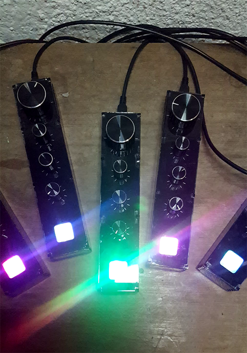

# Portal

---

### Hardware features:
  - High intensity output light trough 4 RGB LEDs in parallel
  - One white LED (not implemented in this version)
  - Encoder with button for navegate trough baks of parameters and programs
  - Potentiometer for control of the frequency
  - Two potentiometer for control of parameters
  - Free acces to Arduino pin-out for add-ons
  - Disadvantages: outsize, fragile, heavy work to built it.
  - Status: DISCONTINUED

### Programs included in this version:
  - Palettes
    + Description: 8 bars of colours across the screen (or camera?)
    + Use: The colour of the 8 bars can be changed moving the encoder and selecting the colour of 2 consecutive bars with the potentiometers.
  - Triangles
    + Description: Triangles and colour addition
    + Use: 3 triangles ( red , green and blue ) can be selected using the enconder. The first potentiometer control the steps of the shape, the second shift the potition of it.
  - Manantial
    + Description: Source and sink of lines randomly generated  
    + Use: 3 sources can be selected with the encoder. The first potentiometer control the colour, the second the probability wich a new line is generated.
  - Paint 
    + Description: For painting with RSD 
    + Use: Use the enconder to move the cursor, the first potentiometer will control if paint or not, and the second with wich colour.
  - Cube
    + Description: Animation of a 3D Cube 
    + Use: Control the colour palette with the first potentiomenter, and the playback velocity with second.
  - Netflix
    + Description: The netflix presentation in 8 colours and 256 pixels 
    + Use: Control playback velocity with the first potentiometer.

---
Facundo Daguerre ( derfaq ) 2022, CC by-nc-sa.
